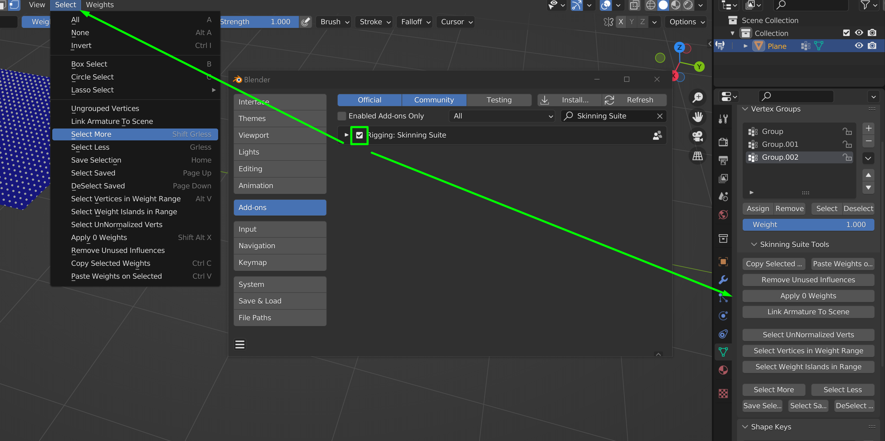

# skinning-suite
Blender addon for skinning workflows.

NOTE: Has not been properly tested in production. Will almost definitely have issues.

Was mostly a way for me to get my feet wet when it comes to creating handy blender tools.

# Install

Download the latest skinning_suite .zip file from the Releases page

Open Blender Preferences - Add-ons and press "Install..."
Find the .zip file and press Install Add-on

Enable the Add-on and use the buttons in the Select menu, or under the vertex groups

