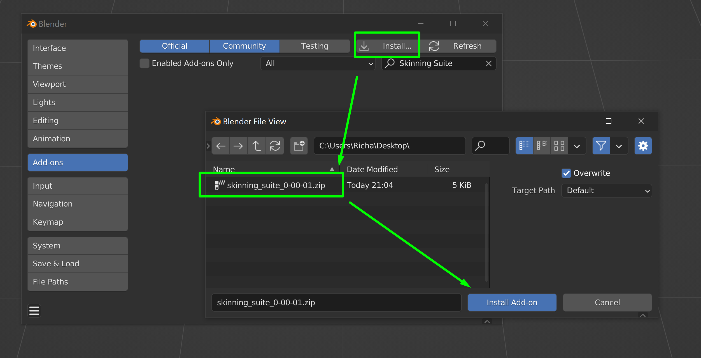

# skinning-suite
Blender addon for weight paint workflows.

These are some simple operators to deal with vertex selections, and other things that I normally use when painting weights.

**NOTE: Has not been properly tested in production. Almost definitely has issues lurking within.**

Was mostly a way for me to get my feet wet when it comes to creating handy blender tools.

Thanks to [Daniel Bystedt](https://twitter.com/3dbystedt) for giving me a bunch of examples of manipulating mesh data. Was absolutely invaluable when getting comfortable with Blender.

# Install

1. Download the latest [skinning_suite .zip file](https://github.com/rBrenick/skinning-suite/releases/download/0.00.01/skinning_suite_0-00-01.zip) from the Releases page

2. Open Blender Preferences - Add-ons and press "Install..."
- Find the .zip file and press "Install Add-on"

3. Enable the Add-on
- use the buttons in the Select menu, or under the vertex groups panel

